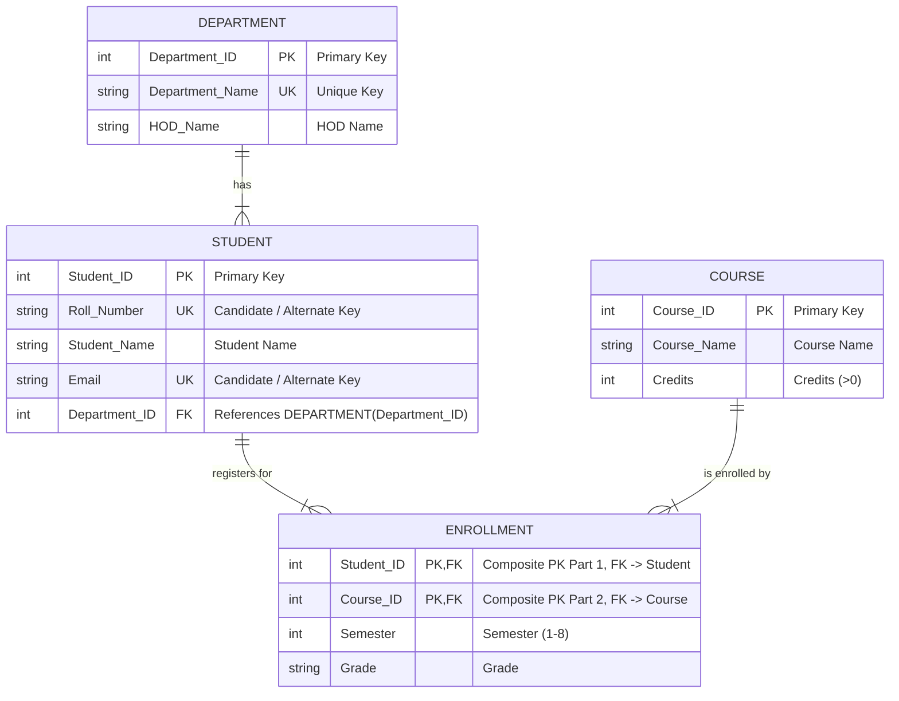

# DBMS Lab Experiment: Implementation and Analysis of Keys in Relational Database

## 1. Objective
To understand and implement different types of keys in a Relational Database Management System (RDBMS), including:
- **Super Key**
- **Candidate Key**
- **Primary Key**
- **Alternate Key / Unique Key**
- **Foreign Key (Referential Integrity)**
- **Composite Primary Key**

---

## 2. Problem Statement
Design and implement a **University Management Database System** using SQL. The database maintains information about academic departments, enrolled students, available courses, and student course registrations (enrollments).

### Entity-Relationship & Schema Design:
1. **Department**: `(Department_ID, Department_Name, HOD_Name)`
2. **Student**: `(Student_ID, Roll_Number, Student_Name, Email, Department_ID)`
3. **Course**: `(Course_ID, Course_Name, Credits)`
4. **Enrollment**: `(Student_ID, Course_ID, Semester, Grade)`

### Entity-Relationship (ER) Diagram
*(For full Chen's notation and drawing details, see [ER_Diagram.md](file:///home/krajtilak/Documents/VScode/DBMS%20Lab/ER_Diagram.md))*



---

## 3. Theoretical Overview of Keys

| Key Type | Definition | Example in Schema |
| :--- | :--- | :--- |
| **Super Key** | A set of one or more attributes that can uniquely identify a tuple in a relation. | `{Student_ID}`, `{Student_ID, Student_Name}`, `{Roll_Number, Email}` |
| **Candidate Key** | A minimal super key with no redundant attributes capable of uniquely identifying a record. | `Student_ID`, `Roll_Number`, `Email` in `Student` |
| **Primary Key** | A chosen candidate key that uniquely identifies each record. Cannot be `NULL`. | `Student_ID` in `Student`, `Department_ID` in `Department` |
| **Alternate Key** | Candidate keys that are not selected as the Primary Key. Implemented using `UNIQUE` constraints. | `Roll_Number`, `Email` in `Student` |
| **Foreign Key** | An attribute or combination of attributes that refers to the Primary Key of another relation, establishing referential integrity. | `Department_ID` in `Student` referencing `Department(Department_ID)` |
| **Composite Key** | A primary key made up of two or more attributes to uniquely identify a record. | `(Student_ID, Course_ID)` in `Enrollment` |

---

## 4. SQL Implementation

### 4.1 Schema Creation (DDL with Constraints)

```sql
-- Enable foreign key support (SQLite)
PRAGMA foreign_keys = ON;

-- 1. Department Table
CREATE TABLE Department (
    Department_ID INT PRIMARY KEY,
    Department_Name VARCHAR(50) NOT NULL UNIQUE,
    HOD_Name VARCHAR(50) NOT NULL
);

-- 2. Course Table
CREATE TABLE Course (
    Course_ID INT PRIMARY KEY,
    Course_Name VARCHAR(100) NOT NULL,
    Credits INT NOT NULL CHECK (Credits > 0)
);

-- 3. Student Table
CREATE TABLE Student (
    Student_ID INT PRIMARY KEY,
    Roll_Number VARCHAR(20) NOT NULL UNIQUE,
    Student_Name VARCHAR(100) NOT NULL,
    Email VARCHAR(100) NOT NULL UNIQUE,
    Department_ID INT NOT NULL,
    FOREIGN KEY (Department_ID) REFERENCES Department(Department_ID)
        ON UPDATE CASCADE
        ON DELETE RESTRICT
);

-- 4. Enrollment Table (Composite Primary Key)
CREATE TABLE Enrollment (
    Student_ID INT NOT NULL,
    Course_ID INT NOT NULL,
    Semester INT NOT NULL CHECK (Semester >= 1 AND Semester <= 8),
    Grade VARCHAR(2) DEFAULT 'NA',
    PRIMARY KEY (Student_ID, Course_ID),
    FOREIGN KEY (Student_ID) REFERENCES Student(Student_ID)
        ON UPDATE CASCADE
        ON DELETE CASCADE,
    FOREIGN KEY (Course_ID) REFERENCES Course(Course_ID)
        ON UPDATE CASCADE
        ON DELETE RESTRICT
);
```

---

### 4.2 Data Insertion (DML)

```sql
-- Insert into Department
INSERT INTO Department (Department_ID, Department_Name, HOD_Name) VALUES
(101, 'Computer Science & Engineering', 'Dr. Aris Thorne'),
(102, 'Electronics & Communication', 'Dr. Meera Nambiar'),
(103, 'Mechanical Engineering', 'Dr. Robert Vance'),
(104, 'Information Technology', 'Dr. Sunita Rao');

-- Insert into Course
INSERT INTO Course (Course_ID, Course_Name, Credits) VALUES
(501, 'Database Management Systems', 4),
(502, 'Data Structures & Algorithms', 4),
(503, 'Digital Signal Processing', 3),
(504, 'Thermodynamics', 3),
(505, 'Computer Networks', 3);

-- Insert into Student
INSERT INTO Student (Student_ID, Roll_Number, Student_Name, Email, Department_ID) VALUES
(1, '23CS101', 'Aarav Sharma', 'aarav.sharma@univ.edu', 101),
(2, '23CS102', 'Bhavna Patel', 'bhavna.patel@univ.edu', 101),
(3, '23EC101', 'Chetan Kumar', 'chetan.kumar@univ.edu', 102),
(4, '23ME101', 'Divya Sen', 'divya.sen@univ.edu', 103),
(5, '23IT101', 'Eshan Verma', 'eshan.verma@univ.edu', 104);

-- Insert into Enrollment
INSERT INTO Enrollment (Student_ID, Course_ID, Semester, Grade) VALUES
(1, 501, 4, 'A+'),
(1, 502, 4, 'A'),
(2, 501, 4, 'A'),
(2, 505, 4, 'B+'),
(3, 503, 4, 'A'),
(4, 504, 4, 'B'),
(5, 501, 4, 'O');
```

---

## 5. Lab Tasks & Demonstrations

### Task 3: Display All Records from Each Table

#### Department Table:
```sql
SELECT * FROM Department;
```
| Department_ID | Department_Name | HOD_Name |
| :--- | :--- | :--- |
| 101 | Computer Science & Engineering | Dr. Aris Thorne |
| 102 | Electronics & Communication | Dr. Meera Nambiar |
| 103 | Mechanical Engineering | Dr. Robert Vance |
| 104 | Information Technology | Dr. Sunita Rao |

#### Course Table:
```sql
SELECT * FROM Course;
```
| Course_ID | Course_Name | Credits |
| :--- | :--- | :--- |
| 501 | Database Management Systems | 4 |
| 502 | Data Structures & Algorithms | 4 |
| 503 | Digital Signal Processing | 3 |
| 504 | Thermodynamics | 3 |
| 505 | Computer Networks | 3 |

#### Student Table:
```sql
SELECT * FROM Student;
```
| Student_ID | Roll_Number | Student_Name | Email | Department_ID |
| :--- | :--- | :--- | :--- | :--- |
| 1 | 23CS101 | Aarav Sharma | aarav.sharma@univ.edu | 101 |
| 2 | 23CS102 | Bhavna Patel | bhavna.patel@univ.edu | 101 |
| 3 | 23EC101 | Chetan Kumar | chetan.kumar@univ.edu | 102 |
| 4 | 23ME101 | Divya Sen | divya.sen@univ.edu | 103 |
| 5 | 23IT101 | Eshan Verma | eshan.verma@univ.edu | 104 |

#### Enrollment Table:
```sql
SELECT * FROM Enrollment;
```
| Student_ID | Course_ID | Semester | Grade |
| :--- | :--- | :--- | :--- |
| 1 | 501 | 4 | A+ |
| 1 | 502 | 4 | A |
| 2 | 501 | 4 | A |
| 2 | 505 | 4 | B+ |
| 3 | 503 | 4 | A |
| 4 | 504 | 4 | B |
| 5 | 501 | 4 | O |

---

### Task 4: Demonstrate Primary Key Violation
Attempting to insert a student with an already existing `Student_ID = 1`:
```sql
INSERT INTO Student (Student_ID, Roll_Number, Student_Name, Email, Department_ID) 
VALUES (1, '23CS199', 'Ghost Student', 'ghost@univ.edu', 101);
```
**Observed Result / Output:**
```text
Error: UNIQUE constraint failed: Student.Student_ID
```
**Explanation:** The Primary Key ensures entity integrity. Duplicate values are rejected by the database engine.

---

### Task 5: Demonstrate Unique Key (Alternate Key) Violation

#### 5a. Attempting duplicate `Roll_Number`:
```sql
INSERT INTO Student (Student_ID, Roll_Number, Student_Name, Email, Department_ID) 
VALUES (6, '23CS101', 'Duplicate Roll User', 'newroll@univ.edu', 101);
```
**Observed Result / Output:**
```text
Error: UNIQUE constraint failed: Student.Roll_Number
```

#### 5b. Attempting duplicate `Email`:
```sql
INSERT INTO Student (Student_ID, Roll_Number, Student_Name, Email, Department_ID) 
VALUES (7, '23CS103', 'Duplicate Email User', 'bhavna.patel@univ.edu', 101);
```
**Observed Result / Output:**
```text
Error: UNIQUE constraint failed: Student.Email
```
**Explanation:** The `UNIQUE` constraint ensures that no two rows share the same non-primary candidate key attribute values.

---

### Task 6: Demonstrate Foreign Key Violation
Attempting to insert a student referencing a non-existent `Department_ID = 999`:
```sql
INSERT INTO Student (Student_ID, Roll_Number, Student_Name, Email, Department_ID) 
VALUES (8, '23CS104', 'Invalid Dept Student', 'invalid@univ.edu', 999);
```
**Observed Result / Output:**
```text
Error: FOREIGN KEY constraint failed
```
**Explanation:** Referential integrity prohibits child tables from referencing non-existent parent keys.

---

### Task 7 & 8: Demonstrate Composite Primary Key Violation in Enrollment
Attempting duplicate registration of Student 1 in Course 501 `(1, 501)`:
```sql
INSERT INTO Enrollment (Student_ID, Course_ID, Semester, Grade) 
VALUES (1, 501, 4, 'A');
```
**Observed Result / Output:**
```text
Error: UNIQUE constraint failed: Enrollment.Student_ID, Enrollment.Course_ID
```
**Explanation:** The composite primary key `(Student_ID, Course_ID)` ensures that a student cannot be registered for the exact same course more than once.

---

### Task 9: Insert Same Student into a Different Course
Inserting Student 1 into Course 505:
```sql
INSERT INTO Enrollment (Student_ID, Course_ID, Semester, Grade) 
VALUES (1, 505, 4, 'A');

SELECT * FROM Enrollment WHERE Student_ID = 1 AND Course_ID = 505;
```
**Observed Result / Output:**
```text
Query executed successfully (1 row affected).
1 | 505 | 4 | A
```
**Explanation:** While `Student_ID = 1` already exists in `Enrollment`, the *pair* `(1, 505)` is distinct, satisfying the Composite Primary Key constraint.

---

### Task 10: Display Student Details with Department Name (JOIN)
```sql
SELECT 
    s.Student_ID,
    s.Roll_Number,
    s.Student_Name,
    s.Email,
    d.Department_Name,
    d.HOD_Name
FROM Student s
INNER JOIN Department d ON s.Department_ID = d.Department_ID
ORDER BY s.Student_ID;
```
**Query Output:**
| Student_ID | Roll_Number | Student_Name | Email | Department_Name | HOD_Name |
| :--- | :--- | :--- | :--- | :--- | :--- |
| 1 | 23CS101 | Aarav Sharma | aarav.sharma@univ.edu | Computer Science & Engineering | Dr. Aris Thorne |
| 2 | 23CS102 | Bhavna Patel | bhavna.patel@univ.edu | Computer Science & Engineering | Dr. Aris Thorne |
| 3 | 23EC101 | Chetan Kumar | chetan.kumar@univ.edu | Electronics & Communication | Dr. Meera Nambiar |
| 4 | 23ME101 | Divya Sen | divya.sen@univ.edu | Mechanical Engineering | Dr. Robert Vance |
| 5 | 23IT101 | Eshan Verma | eshan.verma@univ.edu | Information Technology | Dr. Sunita Rao |

---

### Task 11: Display Courses Registered by a Particular Student
```sql
SELECT 
    s.Student_ID,
    s.Student_Name,
    s.Roll_Number,
    c.Course_ID,
    c.Course_Name,
    c.Credits,
    e.Semester,
    e.Grade
FROM Student s
INNER JOIN Enrollment e ON s.Student_ID = e.Student_ID
INNER JOIN Course c ON e.Course_ID = c.Course_ID
WHERE s.Student_ID = 1;
```
**Query Output:**
| Student_ID | Student_Name | Roll_Number | Course_ID | Course_Name | Credits | Semester | Grade |
| :--- | :--- | :--- | :--- | :--- | :--- | :--- | :--- |
| 1 | Aarav Sharma | 23CS101 | 501 | Database Management Systems | 4 | 4 | A+ |
| 1 | Aarav Sharma | 23CS101 | 502 | Data Structures & Algorithms | 4 | 4 | A |
| 1 | Aarav Sharma | 23CS101 | 505 | Computer Networks | 3 | 4 | A |

---

### Task 12: Display Comprehensive Enrollment Details (Multi-table JOIN)
```sql
SELECT 
    s.Roll_Number,
    s.Student_Name,
    d.Department_Name,
    c.Course_ID,
    c.Course_Name,
    c.Credits,
    e.Semester,
    e.Grade
FROM Enrollment e
INNER JOIN Student s ON e.Student_ID = s.Student_ID
INNER JOIN Department d ON s.Department_ID = d.Department_ID
INNER JOIN Course c ON e.Course_ID = c.Course_ID
ORDER BY s.Student_ID, c.Course_ID;
```
**Query Output:**
| Roll_Number | Student_Name | Department_Name | Course_ID | Course_Name | Credits | Semester | Grade |
| :--- | :--- | :--- | :--- | :--- | :--- | :--- | :--- |
| 23CS101 | Aarav Sharma | Computer Science & Engineering | 501 | Database Management Systems | 4 | 4 | A+ |
| 23CS101 | Aarav Sharma | Computer Science & Engineering | 502 | Data Structures & Algorithms | 4 | 4 | A |
| 23CS101 | Aarav Sharma | Computer Science & Engineering | 505 | Computer Networks | 3 | 4 | A |
| 23CS102 | Bhavna Patel | Computer Science & Engineering | 501 | Database Management Systems | 4 | 4 | A |
| 23CS102 | Bhavna Patel | Computer Science & Engineering | 505 | Computer Networks | 3 | 4 | B+ |
| 23EC101 | Chetan Kumar | Electronics & Communication | 503 | Digital Signal Processing | 3 | 4 | A |
| 23ME101 | Divya Sen | Mechanical Engineering | 504 | Thermodynamics | 3 | 4 | B |
| 23IT101 | Eshan Verma | Information Technology | 501 | Database Management Systems | 4 | 4 | O |

---

## 6. Identification of Keys in Each Table (Task 13)

### 1. `Department` Table
- **Candidate Keys:** `{Department_ID}`, `{Department_Name}`
- **Primary Key:** `Department_ID`
- **Alternate Key:** `Department_Name` (enforced with `UNIQUE`)
- **Super Keys:** `{Department_ID}`, `{Department_Name}`, `{Department_ID, Department_Name}`, `{Department_ID, HOD_Name}`, `{Department_Name, HOD_Name}`, `{Department_ID, Department_Name, HOD_Name}`
- **Foreign Keys:** *None*

### 2. `Student` Table
- **Candidate Keys:** `{Student_ID}`, `{Roll_Number}`, `{Email}`
- **Primary Key:** `Student_ID`
- **Alternate Keys:** `Roll_Number`, `Email` (enforced with `UNIQUE`)
- **Super Keys:** Any superset of any Candidate Key (e.g., `{Student_ID, Student_Name}`, `{Roll_Number, Department_ID}`)
- **Foreign Key:** `Department_ID` references `Department(Department_ID)`

### 3. `Course` Table
- **Candidate Keys:** `{Course_ID}`
- **Primary Key:** `Course_ID`
- **Alternate Keys:** *None*
- **Super Keys:** `{Course_ID}`, `{Course_ID, Course_Name}`, `{Course_ID, Credits}`, `{Course_ID, Course_Name, Credits}`
- **Foreign Keys:** *None*

### 4. `Enrollment` Table
- **Candidate Keys:** `{(Student_ID, Course_ID)}`
- **Primary Key / Composite Primary Key:** `(Student_ID, Course_ID)`
- **Alternate Keys:** *None*
- **Super Keys:** `{(Student_ID, Course_ID)}`, `{(Student_ID, Course_ID, Semester)}`, `{(Student_ID, Course_ID, Grade)}`, `{(Student_ID, Course_ID, Semester, Grade)}`
- **Foreign Keys:**
  - `Student_ID` references `Student(Student_ID)`
  - `Course_ID` references `Course(Course_ID)`

---

## 7. Conclusion
In this experiment, relational database keys and constraints were systematically designed, implemented, and verified using SQL. Integrity rules—such as Entity Integrity (Primary Keys and Composite Keys), Domain Integrity (Check constraints), and Referential Integrity (Foreign Keys)—were successfully tested and observed to prevent invalid or inconsistent data entries.
