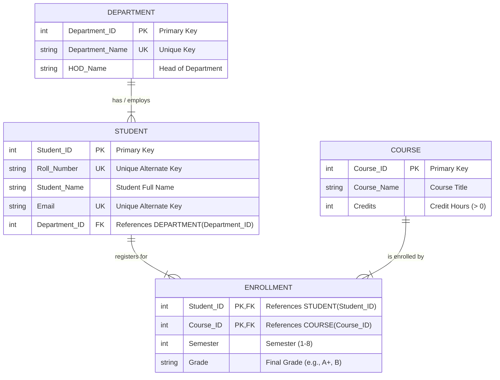

# Entity-Relationship (ER) Diagram: University Management Database

This document contains the complete **Entity-Relationship (ER) Diagram**, including **Chen's Notation (Conceptual Model)**, **Crow's Foot Notation (Logical/Physical Model)**, Entity-Attribute breakdowns, and ER-to-Relational mapping rules suitable for DBMS lab manuals and viva examinations.

---

## 1. Conceptual ER Diagram (Chen's Notation Overview)

In standard DBMS Chen's Notation:
- **Rectangles** represent **Entities** (`DEPARTMENT`, `STUDENT`, `COURSE`).
- **Ovals / Ellipses** represent **Attributes**:
  - **Key Attributes** (Primary Keys) are **underlined** (e.g., <u>Department_ID</u>, <u>Student_ID</u>, <u>Course_ID</u>).
  - **Unique / Alternate Key Attributes** have unique identifiers (e.g., <u>Roll_Number</u>, <u>Email</u>).
- **Diamonds** represent **Relationships**:
  - `Belongs_To` / `Has`: Connects `DEPARTMENT` (1) and `STUDENT` (N).
  - `Enrolls_In` / `Registers`: Connects `STUDENT` (M) and `COURSE` (N), with descriptive attributes **`Semester`** and **`Grade`**.
- **Double Rectangle** / **Associative Entity**: `ENROLLMENT` represents the M:N resolution table with composite key `(Student_ID, Course_ID)`.

```
                      +-------------------+
                      |    DEPARTMENT     |
                      +---------+---------+
                                | (1)
                                |
                                | [HAS / BELONGS_TO]
                                |
                                | (N)
                      +---------v---------+
                      |      STUDENT      |
                      +---------+---------+
                                | (M)
                                |
                         [ ENROLLS_IN ] ---- (Semester, Grade)
                                |
                                | (N)
                      +---------v---------+
                      |      COURSE       |
                      +-------------------+
```

---

## 2. Logical ER Diagram (Crow's Foot Relational Notation)



---

## 3. Detailed Entity and Attribute Breakdown

### 1. `DEPARTMENT` Entity
- **Description:** Represents an academic department within the institution.
- **Attributes:**
  - `Department_ID` *(Key Attribute, Integer)*: Uniquely identifies each department.
  - `Department_Name` *(Unique Attribute, String)*: Name of the department.
  - `HOD_Name` *(Simple, Single-valued Attribute, String)*: Name of the Head of Department.

### 2. `STUDENT` Entity
- **Description:** Represents a student enrolled in the university.
- **Attributes:**
  - `Student_ID` *(Key Attribute, Integer)*: Unique surrogate primary key.
  - `Roll_Number` *(Candidate / Alternate Key, String)*: Academic roll number assigned to the student.
  - `Student_Name` *(Simple, Single-valued Attribute, String)*: Name of the student.
  - `Email` *(Candidate / Alternate Key, String)*: University email address.
  - `Department_ID` *(Foreign Key Attribute, Integer)*: ID of the department the student belongs to.

### 3. `COURSE` Entity
- **Description:** Represents an academic course offered by the university.
- **Attributes:**
  - `Course_ID` *(Key Attribute, Integer)*: Uniquely identifies each course.
  - `Course_Name` *(Simple Attribute, String)*: Title of the course.
  - `Credits` *(Simple Attribute, Integer)*: Academic credit points.

### 4. `ENROLLMENT` Entity (Associative / Junction Entity)
- **Description:** Resolves the Many-to-Many ($M:N$) relationship between `STUDENT` and `COURSE`.
- **Attributes:**
  - `Student_ID` *(Composite Primary Key Part 1 / Foreign Key)*: Refers to `STUDENT(Student_ID)`.
  - `Course_ID` *(Composite Primary Key Part 2 / Foreign Key)*: Refers to `COURSE(Course_ID)`.
  - `Semester` *(Descriptive Attribute, Integer)*: The semester in which the student registered for the course.
  - `Grade` *(Descriptive Attribute, String)*: The grade secured by the student.

---

## 4. Relationship Details & Cardinality Ratios

| Relationship | Participating Entities | Cardinality Ratio | Participation Constraint | Descriptive Attributes | Description |
| :--- | :--- | :---: | :---: | :--- | :--- |
| **`Belongs_To`** | `DEPARTMENT` &rarr; `STUDENT` | **1 : N** (One-to-Many) | `DEPARTMENT` (Partial / Total)<br>`STUDENT` (Total) | *None* | A department has many students; each student belongs to exactly one department. |
| **`Enrolls_In`** | `STUDENT` &harr; `COURSE` | **M : N** (Many-to-Many) | `STUDENT` (Partial / Total)<br>`COURSE` (Partial / Total) | `Semester`, `Grade` | A student can register for multiple courses; a course can have multiple students enrolled. |

---

## 5. ER to Relational Schema Mapping Rules

1. **Strong Entity Sets:**
   - `DEPARTMENT` &rarr; `Department(<u>Department_ID</u>, Department_Name, HOD_Name)`
   - `COURSE` &rarr; `Course(<u>Course_ID</u>, Course_Name, Credits)`

2. **1 : N Binary Relationship (`Belongs_To`):**
   - The primary key of the "1" side (`Department_ID`) is added as a foreign key on the "N" side (`STUDENT`).
   - `STUDENT` &rarr; `Student(<u>Student_ID</u>, Roll_Number, Student_Name, Email, <i>Department_ID</i>)`

3. **M : N Binary Relationship with Descriptive Attributes (`Enrolls_In`):**
   - A new relation (`ENROLLMENT`) is created containing the primary keys of both participating entities as foreign keys, which together form the **Composite Primary Key**, plus any descriptive attributes.
   - `ENROLLMENT` &rarr; `Enrollment(<u><i>Student_ID</i>, <i>Course_ID</i></u>, Semester, Grade)`

---

## 6. ASCII Diagram for Lab Notebook / Exam Sketching

```
      +--------------------+                      +--------------------+
      |    DEPARTMENT      |                      |       COURSE       |
      +--------------------+                      +--------------------+
      | * Department_ID    |                      | * Course_ID        |
      | o Department_Name  |                      | o Course_Name      |
      | o HOD_Name         |                      | o Credits          |
      +---------+----------+                      +---------+----------+
                |                                           |
                | 1                                         | 1
                |                                           |
                | has                                       | enrolled_in
                |                                           |
                | N                                         | N
      +---------v----------+                      +---------v----------+
      |      STUDENT       |                      |     ENROLLMENT     |
      +--------------------+                      +--------------------+
      | * Student_ID       | 1                  N | *# Student_ID      |
      | o Roll_Number (UK) +--------------------->| *# Course_ID       |
      | o Student_Name     |      registers       |  o Semester        |
      | o Email (UK)       |                      |  o Grade           |
      | # Department_ID    |                      +--------------------+
      +--------------------+

Legend:
  *  = Primary Key (Underlined in Chen's notation)
  #  = Foreign Key
  UK = Unique Key
  o  = Regular Attribute
```
