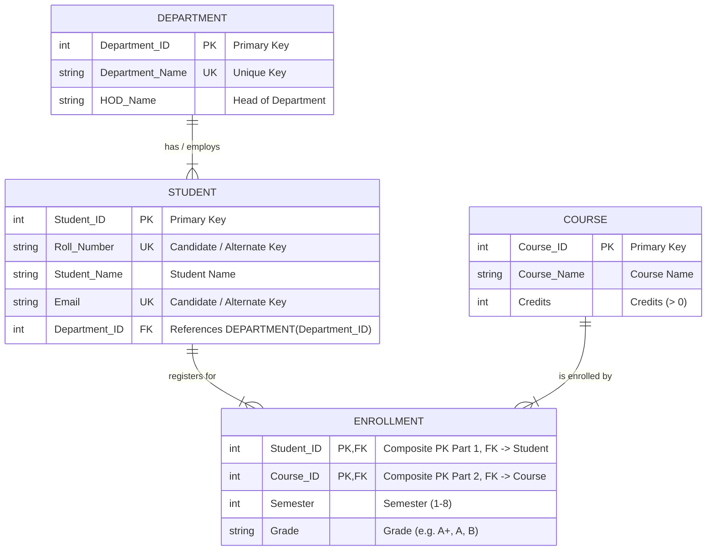

# DBMS Lab Assignment 2: Implementation of Different Types of Keys in Relational Database

## 1. Objective
To understand, design, and implement different types of keys in a Relational Database Management System (RDBMS), including:
- **Primary Key** (Entity Integrity)
- **Candidate Key & Alternate / Unique Key**
- **Foreign Key** (Referential Integrity)
- **Composite Primary Key**
- **Super Key**

---

## 2. Problem Statement
Design and implement a **University Management Database System** using SQL. The database maintains information about academic departments, registered students, available courses, and student course enrollments.

### Entities & Relational Schema:
1. **Department**: `(<u>Department_ID</u>, Department_Name, HOD_Name)`
2. **Student**: `(<u>Student_ID</u>, Roll_Number, Student_Name, Email, <i>Department_ID</i>)`
3. **Course**: `(<u>Course_ID</u>, Course_Name, Credits)`
4. **Enrollment**: `(<u><i>Student_ID</i>, <i>Course_ID</i></u>, Semester, Grade)`

---

## 3. Entity-Relationship (ER) Diagram

### 3.1 Relational ER Diagram (Crow's Foot Notation)



### 3.2 Conceptual ER Diagram (Chen's Notation)

```text
                  ( Department_Name )   ( HOD_Name )
                            \           /
                       ( <u>Department_ID</u> )
                                  |
                        +---------+---------+
                        |    DEPARTMENT     |
                        +---------+---------+
                                  | (1)
                                  |
                               < HAS >
                                  |
                                  | (N)
                        +---------+---------+
                        |      STUDENT      |
                        +---------+---------+
                       /     |         |     \
    ( <u>Student_ID</u> ) ( <u>Roll_No</u> ) ( Student_Name ) ( <u>Email</u> )
                                  | (M)
                                  |
                             < ENROLLS > ----- ( Semester )
                                  |       \
                                  | (N)    ( Grade )
                        +---------+---------+
                        |      COURSE       |
                        +---------+---------+
                                  |
                       ( <u>Course_ID</u> )
                            /           \
                 ( Course_Name )      ( Credits )
```

---

## 4. SQL Implementation

### 4.1 Schema Creation (Task 1 & Task 7)

```sql
PRAGMA foreign_keys = ON;

-- 1. Department Table
CREATE TABLE Department (
    Department_ID INT PRIMARY KEY,
    Department_Name VARCHAR(50) NOT NULL UNIQUE,
    HOD_Name VARCHAR(50) NOT NULL
);

-- 2. Course Table
CREATE TABLE Course (
    Course_ID INT PRIMARY KEY,
    Course_Name VARCHAR(100) NOT NULL,
    Credits INT NOT NULL CHECK (Credits > 0)
);

-- 3. Student Table (Candidate Keys: Roll_Number, Email | Foreign Key: Department_ID)
CREATE TABLE Student (
    Student_ID INT PRIMARY KEY,
    Roll_Number VARCHAR(20) NOT NULL UNIQUE,
    Student_Name VARCHAR(100) NOT NULL,
    Email VARCHAR(100) NOT NULL UNIQUE,
    Department_ID INT NOT NULL,
    FOREIGN KEY (Department_ID) REFERENCES Department(Department_ID)
        ON UPDATE CASCADE
        ON DELETE RESTRICT
);

-- 4. Enrollment Table (Composite Primary Key: Student_ID + Course_ID)
CREATE TABLE Enrollment (
    Student_ID INT NOT NULL,
    Course_ID INT NOT NULL,
    Semester INT NOT NULL CHECK (Semester >= 1 AND Semester <= 8),
    Grade VARCHAR(2) DEFAULT 'NA',
    PRIMARY KEY (Student_ID, Course_ID),
    FOREIGN KEY (Student_ID) REFERENCES Student(Student_ID)
        ON UPDATE CASCADE
        ON DELETE CASCADE,
    FOREIGN KEY (Course_ID) REFERENCES Course(Course_ID)
        ON UPDATE CASCADE
        ON DELETE RESTRICT
);
```

---

### 4.2 Data Insertion (Task 2)

```sql
-- Insert into Department
INSERT INTO Department (Department_ID, Department_Name, HOD_Name) VALUES
(101, 'Computer Science & Engineering', 'Dr. Aris Thorne'),
(102, 'Electronics & Communication', 'Dr. Meera Nambiar'),
(103, 'Mechanical Engineering', 'Dr. Robert Vance'),
(104, 'Information Technology', 'Dr. Sunita Rao');

-- Insert into Course
INSERT INTO Course (Course_ID, Course_Name, Credits) VALUES
(501, 'Database Management Systems', 4),
(502, 'Data Structures & Algorithms', 4),
(503, 'Digital Signal Processing', 3),
(504, 'Thermodynamics', 3),
(505, 'Computer Networks', 3);

-- Insert into Student
INSERT INTO Student (Student_ID, Roll_Number, Student_Name, Email, Department_ID) VALUES
(1, '23CS101', 'Aarav Sharma', 'aarav.sharma@univ.edu', 101),
(2, '23CS102', 'Bhavna Patel', 'bhavna.patel@univ.edu', 101),
(3, '23EC101', 'Chetan Kumar', 'chetan.kumar@univ.edu', 102),
(4, '23ME101', 'Divya Sen', 'divya.sen@univ.edu', 103),
(5, '23IT101', 'Eshan Verma', 'eshan.verma@univ.edu', 104);

-- Insert into Enrollment
INSERT INTO Enrollment (Student_ID, Course_ID, Semester, Grade) VALUES
(1, 501, 4, 'A+'),
(1, 502, 4, 'A'),
(2, 501, 4, 'A'),
(2, 505, 4, 'B+'),
(3, 503, 4, 'A'),
(4, 504, 4, 'B'),
(5, 501, 4, 'O');
```

---

## 5. Lab Task Demonstrations & Query Outputs

### Task 3: Display Records from Each Table

#### `Department` Table:
```sql
SELECT * FROM Department;
```
| Department_ID | Department_Name | HOD_Name |
| :--- | :--- | :--- |
| 101 | Computer Science & Engineering | Dr. Aris Thorne |
| 102 | Electronics & Communication | Dr. Meera Nambiar |
| 103 | Mechanical Engineering | Dr. Robert Vance |
| 104 | Information Technology | Dr. Sunita Rao |

#### `Course` Table:
```sql
SELECT * FROM Course;
```
| Course_ID | Course_Name | Credits |
| :--- | :--- | :--- |
| 501 | Database Management Systems | 4 |
| 502 | Data Structures & Algorithms | 4 |
| 503 | Digital Signal Processing | 3 |
| 504 | Thermodynamics | 3 |
| 505 | Computer Networks | 3 |

#### `Student` Table:
```sql
SELECT * FROM Student;
```
| Student_ID | Roll_Number | Student_Name | Email | Department_ID |
| :--- | :--- | :--- | :--- | :--- |
| 1 | 23CS101 | Aarav Sharma | aarav.sharma@univ.edu | 101 |
| 2 | 23CS102 | Bhavna Patel | bhavna.patel@univ.edu | 101 |
| 3 | 23EC101 | Chetan Kumar | chetan.kumar@univ.edu | 102 |
| 4 | 23ME101 | Divya Sen | divya.sen@univ.edu | 103 |
| 5 | 23IT101 | Eshan Verma | eshan.verma@univ.edu | 104 |

#### `Enrollment` Table:
```sql
SELECT * FROM Enrollment;
```
| Student_ID | Course_ID | Semester | Grade |
| :--- | :--- | :--- | :--- |
| 1 | 501 | 4 | A+ |
| 1 | 502 | 4 | A |
| 2 | 501 | 4 | A |
| 2 | 505 | 4 | B+ |
| 3 | 503 | 4 | A |
| 4 | 504 | 4 | B |
| 5 | 501 | 4 | O |

---

### Task 4: Primary Key Constraint Demonstration
Attempting to insert a student with existing `Student_ID = 1`:
```sql
INSERT INTO Student (Student_ID, Roll_Number, Student_Name, Email, Department_ID) 
VALUES (1, '23CS199', 'Ghost Student', 'ghost@univ.edu', 101);
```
- **Observed Result:** `Error: UNIQUE constraint failed: Student.Student_ID`
- **Inference:** Duplicate primary keys violate entity integrity.

---

### Task 5: Unique Key (Alternate Key) Demonstrations

#### 5a. Duplicate `Roll_Number`:
```sql
INSERT INTO Student (Student_ID, Roll_Number, Student_Name, Email, Department_ID) 
VALUES (6, '23CS101', 'Duplicate Roll User', 'newroll@univ.edu', 101);
```
- **Observed Result:** `Error: UNIQUE constraint failed: Student.Roll_Number`

#### 5b. Duplicate `Email`:
```sql
INSERT INTO Student (Student_ID, Roll_Number, Student_Name, Email, Department_ID) 
VALUES (7, '23CS103', 'Duplicate Email User', 'bhavna.patel@univ.edu', 101);
```
- **Observed Result:** `Error: UNIQUE constraint failed: Student.Email`
- **Inference:** The `UNIQUE` constraint guarantees uniqueness for all candidate keys not chosen as the Primary Key.

---

### Task 6: Foreign Key Constraint Demonstration
Attempting to insert a student with an invalid `Department_ID = 999`:
```sql
INSERT INTO Student (Student_ID, Roll_Number, Student_Name, Email, Department_ID) 
VALUES (8, '23CS104', 'Invalid Dept Student', 'invalid@univ.edu', 999);
```
- **Observed Result:** `Error: FOREIGN KEY constraint failed`
- **Inference:** Referential integrity prevents referencing non-existent parent records.

---

### Task 8: Composite Primary Key Constraint Violation
Attempting duplicate combination `(Student_ID = 1, Course_ID = 501)`:
```sql
INSERT INTO Enrollment (Student_ID, Course_ID, Semester, Grade) 
VALUES (1, 501, 4, 'A');
```
- **Observed Result:** `Error: UNIQUE constraint failed: Enrollment.Student_ID, Enrollment.Course_ID`

---

### Task 9: Inserting the Same Student into a Different Course
```sql
INSERT INTO Enrollment (Student_ID, Course_ID, Semester, Grade) 
VALUES (1, 505, 4, 'A');

SELECT * FROM Enrollment WHERE Student_ID = 1 AND Course_ID = 505;
```
- **Observed Result:** Query executed successfully.
- **Inference:** A composite primary key allows repeated values in individual columns as long as the combined pair `(Student_ID, Course_ID)` is unique.

---

### Task 10: Student Details with Department Name (JOIN)
```sql
SELECT 
    s.Student_ID,
    s.Roll_Number,
    s.Student_Name,
    s.Email,
    d.Department_Name,
    d.HOD_Name
FROM Student s
INNER JOIN Department d ON s.Department_ID = d.Department_ID
ORDER BY s.Student_ID;
```
**Output:**
| Student_ID | Roll_Number | Student_Name | Email | Department_Name | HOD_Name |
| :--- | :--- | :--- | :--- | :--- | :--- |
| 1 | 23CS101 | Aarav Sharma | aarav.sharma@univ.edu | Computer Science & Engineering | Dr. Aris Thorne |
| 2 | 23CS102 | Bhavna Patel | bhavna.patel@univ.edu | Computer Science & Engineering | Dr. Aris Thorne |
| 3 | 23EC101 | Chetan Kumar | chetan.kumar@univ.edu | Electronics & Communication | Dr. Meera Nambiar |
| 4 | 23ME101 | Divya Sen | divya.sen@univ.edu | Mechanical Engineering | Dr. Robert Vance |
| 5 | 23IT101 | Eshan Verma | eshan.verma@univ.edu | Information Technology | Dr. Sunita Rao |

---

### Task 11: Courses Registered by a Particular Student
```sql
SELECT 
    s.Student_ID,
    s.Student_Name,
    s.Roll_Number,
    c.Course_ID,
    c.Course_Name,
    c.Credits,
    e.Semester,
    e.Grade
FROM Student s
INNER JOIN Enrollment e ON s.Student_ID = e.Student_ID
INNER JOIN Course c ON e.Course_ID = c.Course_ID
WHERE s.Student_ID = 1;
```
**Output:**
| Student_ID | Student_Name | Roll_Number | Course_ID | Course_Name | Credits | Semester | Grade |
| :--- | :--- | :--- | :--- | :--- | :--- | :--- | :--- |
| 1 | Aarav Sharma | 23CS101 | 501 | Database Management Systems | 4 | 4 | A+ |
| 1 | Aarav Sharma | 23CS101 | 502 | Data Structures & Algorithms | 4 | 4 | A |
| 1 | Aarav Sharma | 23CS101 | 505 | Computer Networks | 3 | 4 | A |

---

### Task 12: Comprehensive Enrollment Details (3-Table JOIN)
```sql
SELECT 
    s.Roll_Number,
    s.Student_Name,
    d.Department_Name,
    c.Course_ID,
    c.Course_Name,
    c.Credits,
    e.Semester,
    e.Grade
FROM Enrollment e
INNER JOIN Student s ON e.Student_ID = s.Student_ID
INNER JOIN Department d ON s.Department_ID = d.Department_ID
INNER JOIN Course c ON e.Course_ID = c.Course_ID
ORDER BY s.Student_ID, c.Course_ID;
```
**Output:**
| Roll_Number | Student_Name | Department_Name | Course_ID | Course_Name | Credits | Semester | Grade |
| :--- | :--- | :--- | :--- | :--- | :--- | :--- | :--- |
| 23CS101 | Aarav Sharma | Computer Science & Engineering | 501 | Database Management Systems | 4 | 4 | A+ |
| 23CS101 | Aarav Sharma | Computer Science & Engineering | 502 | Data Structures & Algorithms | 4 | 4 | A |
| 23CS101 | Aarav Sharma | Computer Science & Engineering | 505 | Computer Networks | 3 | 4 | A |
| 23CS102 | Bhavna Patel | Computer Science & Engineering | 501 | Database Management Systems | 4 | 4 | A |
| 23CS102 | Bhavna Patel | Computer Science & Engineering | 505 | Computer Networks | 3 | 4 | B+ |
| 23EC101 | Chetan Kumar | Electronics & Communication | 503 | Digital Signal Processing | 3 | 4 | A |
| 23ME101 | Divya Sen | Mechanical Engineering | 504 | Thermodynamics | 3 | 4 | B |
| 23IT101 | Eshan Verma | Information Technology | 501 | Database Management Systems | 4 | 4 | O |

---

## 6. Identification of Keys in Each Table (Task 13)

| Table Name | Primary Key | Candidate Keys | Alternate Keys | Foreign Key(s) | Composite Key |
| :--- | :--- | :--- | :--- | :--- | :--- |
| **`Department`** | `Department_ID` | `{Department_ID}`, `{Department_Name}` | `Department_Name` | *None* | *None* |
| **`Student`** | `Student_ID` | `{Student_ID}`, `{Roll_Number}`, `{Email}` | `Roll_Number`, `Email` | `Department_ID` &rarr; `Department(Department_ID)` | *None* |
| **`Course`** | `Course_ID` | `{Course_ID}` | *None* | *None* | *None* |
| **`Enrollment`** | `(Student_ID, Course_ID)` | `{(Student_ID, Course_ID)}` | *None* | `Student_ID` &rarr; `Student(Student_ID)`<br>`Course_ID` &rarr; `Course(Course_ID)` | `(Student_ID, Course_ID)` |

---

## 7. Conclusion
In this assignment, relational keys and database constraints were successfully implemented and tested. Entity Integrity (Primary Keys and Composite Keys), Referential Integrity (Foreign Keys), and Candidate/Alternate Keys (`UNIQUE` constraints) were validated through SQL operations and error test cases.
